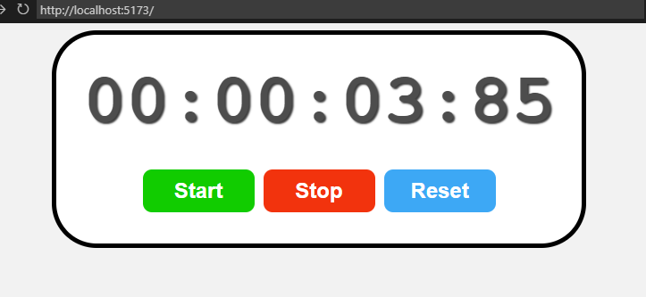

All rights goes to the https://www.youtube.com/@BroCodez and his React course https://www.youtube.com/watch?v=CgkZ7MvWUAA

main branch represents clear state, while inside of div each branch represnts a part of his tutorial

Final part of brocode tutorial. Using all knowledge from before (mainly useEffect, useRef and useState) make a simple stopwatch

